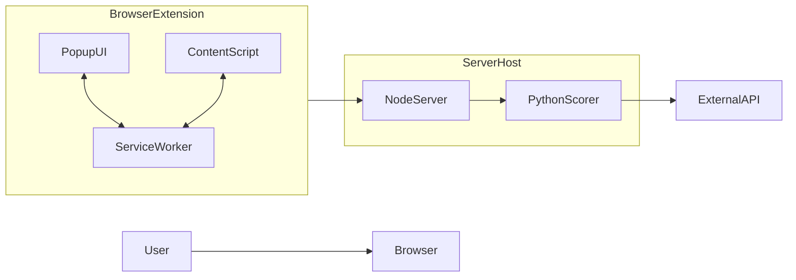
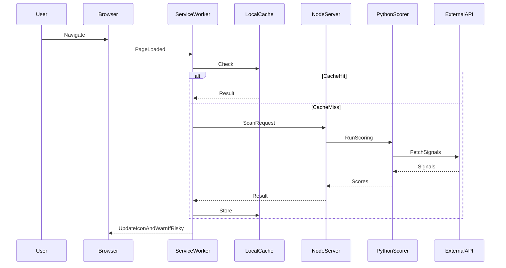
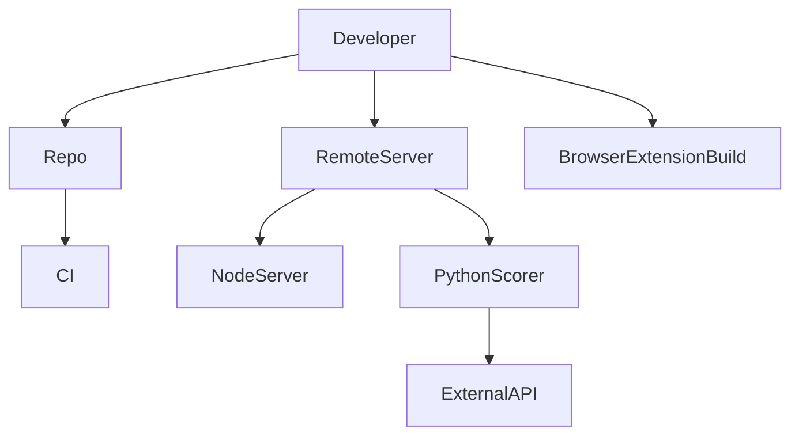

# NetSTAR Shield — System Architecture

This document captures the **big concepts** of how the system works end-to-end.

## Diagram 1 — High-Level System

## Diagram 2 — High-Level Scan Flow

## Diagram 3 — Deployment (Big Picture)

