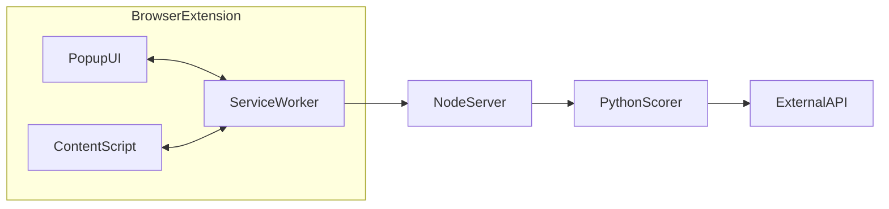
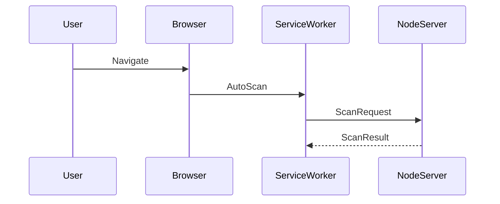

# NetSTAR Extension Architecture

This document describes the current architecture of the NetSTAR Shield browser extension as implemented in this repository.

## System Overview

## Data Flow Architecture

